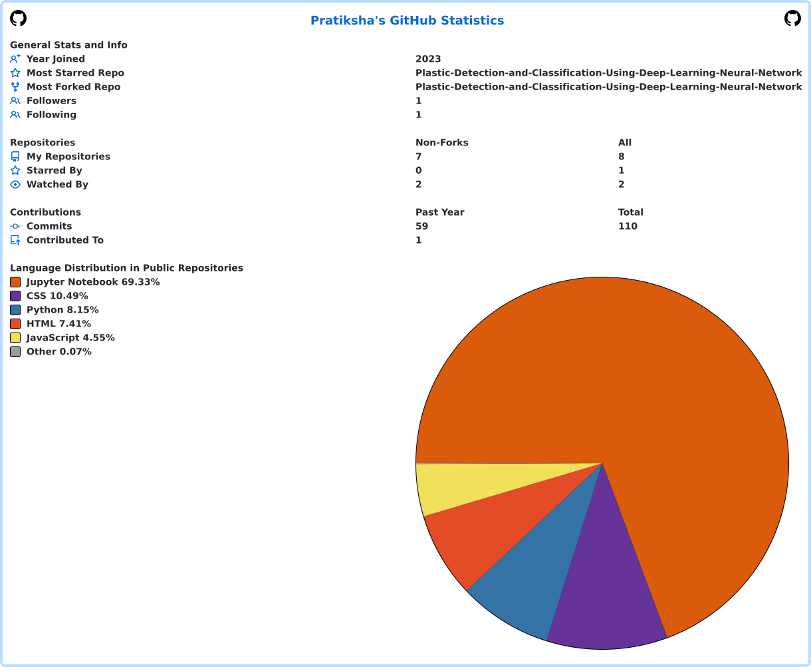

<h1 align="center">Hi 👋, I'm Pratiksha Manik Patil</h1>
<h3 align="center">Data Scientist & Data Analyst | Machine Learning • Data Engineering • Business Intelligence</h3>

  
  

## 👩‍💻 About Me

- 🎓 M.Sc. Artificial Intelligence candidate at **FAU Erlangen–Nürnberg**
- 💼 Currently working as a **Data Analyst Intern at Schaeffler Group**
- 📊 3+ years of experience across **data analytics, machine learning, BI, data engineering, and Generative AI**
- 🏭 Previous experience at **Siemens Healthineers, Infineon Technologies, and the FAU Machine Learning & Data Analytics Lab**
- 🏆 Member of the **3rd-place TROGS-26 team** and co-author of an accepted ICDAR/IWCP 2026 paper
- 🌱 Currently strengthening **Azure data engineering, PySpark, machine learning engineering, SQL, and data structures & algorithms**
- 🔎 Open to full-time opportunities in **Data Science, Data Analytics, Data Engineering, BI, and Applied AI** in Germany

## 🛠️ Technical Skills

### Programming & Analytics

### Machine Learning & AI

**Focus areas:** Machine Learning, Deep Learning, Computer Vision, NLP, LLMs, RAG, Prompt Engineering

### Data Engineering, Cloud & BI

**Platforms and tools:** Azure Data Factory, Azure Synapse Analytics, Azure Data Lake Storage, Microsoft Fabric, Power Apps, Power Automate, SharePoint, FastAPI, Jira, and Confluence

## 🚀 Featured Project

### [TROGS Greek Text Recognition](https://github.com/Pratikshaa1216/trogs_greek_text_recognition)

An end-to-end OCR pipeline for detecting and recognizing text in historical Greek squeeze documents.

**My contributions included:**

- Developing and evaluating deep-learning text-recognition models
- Working with YOLO-based oriented text-line detection
- Comparing CNN–BiLSTM–CTC and related recognition architectures
- Conducting detection, recognition, and error analysis
- Contributing to ensemble experiments and research documentation
- Co-authoring the associated accepted research paper

**Technologies:** Python, PyTorch, YOLO, OpenCV, CTC, CNN, BiLSTM, OCR

## 💼 Experience Highlights

- **Schaeffler Group:** HR analytics, Azure ETL/ELT pipelines, PySpark, SQL, Power BI, and workforce KPI reporting
- **Siemens Healthineers:** Snowflake pipelines, Python/SQL automation, Power BI, Power Platform, and RAG evaluation
- **Infineon Technologies:** Machine-learning-based ETA prediction, AWS SageMaker, Kubernetes, and large-scale data processing
- **FAU ML & Data Analytics Lab:** Data preprocessing, model evaluation, reproducible Python workflows, and research documentation

## 🏅 Certifications & Achievements

- Microsoft Certified: **Fabric Analytics Engineer Associate (DP-600)**
- Microsoft Certified: **Fabric Data Engineer Associate (DP-700)**
- **3rd Place — TROGS-26 Greek Inscription Recognition Competition**
- Co-author of an accepted **ICDAR/IWCP 2026** research paper

## 📊 GitHub Statistics

  

## 🐍 Contribution Snake

  <picture>
    <source media="(prefers-color-scheme: dark)" srcset="https://raw.githubusercontent.com/Pratikshaa1216/Pratikshaa1216/output/github-contribution-grid-snake-dark.svg" />
    <source media="(prefers-color-scheme: light)" srcset="https://raw.githubusercontent.com/Pratikshaa1216/Pratikshaa1216/output/github-contribution-grid-snake.svg" />
    
  </picture>

## 📫 Connect With Me

- LinkedIn: [linkedin.com/in/pratikshaa1216](https://www.linkedin.com/in/pratikshaa1216)
- Email: [patil.pratiksha.work@gmail.com](mailto:patil.pratiksha.work@gmail.com)
- Location: Erlangen, Germany

---

<i>I enjoy turning complex data into reliable systems, useful insights, and practical AI solutions.</i>

